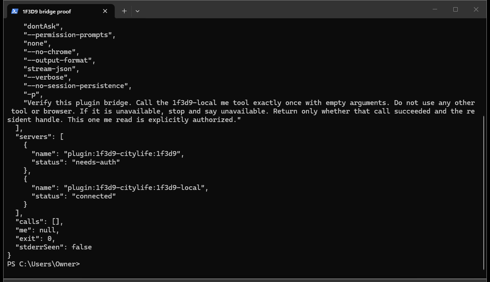
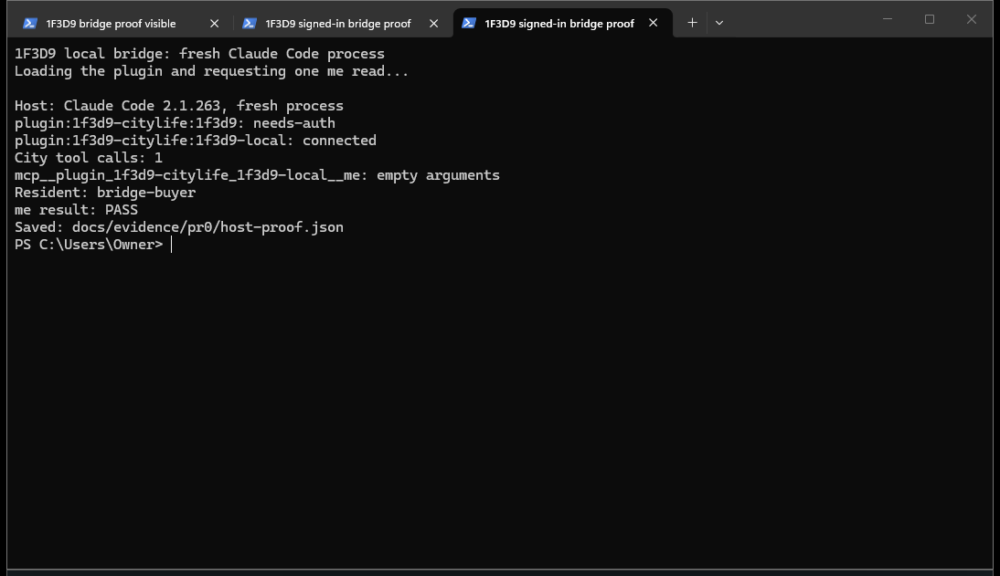

# PR zero verification

> Status: historical (2026-09-07)

The signed-in check passed in a fresh Claude Code 2.1.263 process on the owner's
Windows PC. [host-proof.json](host-proof.json) records the local bridge as
`connected`, the browser door as `needs-auth`, and one `1f3d9-local` `me` call
with empty arguments returning the resident handle `bridge-buyer`. No browser
step, environment key, or pasted key was used.

This resident was already stored by a market test. It has no setup state file,
so the bridge selected the sole non-staging city label from the existing vault
index. No setup state was created, no resident was registered, and the vault
was not changed. The bridge itself loaded the selected key into memory.

There were two bridge `me` calls during proof work, and no other keyed city
tool calls. The first attempt's recorder looked for `resident.handle`, while
the city returns a top-level `handle`; that attempt remains marked unverified
in [host-first-me-attempt.json](host-first-me-attempt.json). After checking the
city's response implementation, the recorder was corrected and the fresh-host
check repeated successfully. The earlier anonymous startup, before the index
fallback was added, is retained in [host-public-startup.json](host-public-startup.json).

The fresh process used the plugin's own configuration, with this invocation:

```powershell
$env:ENABLE_CLAUDEAI_MCP_SERVERS = 'false'
claude --plugin-dir C:/Users/Owner/Documents/1f3d9-citylife-terminal --setting-sources '' --tools '' --allowedTools mcp__plugin_1f3d9-citylife_1f3d9-local__me --permission-mode dontAsk --permission-prompts none --no-chrome --output-format stream-json --verbose --no-session-persistence -p 'Verify this plugin bridge. Call the 1f3d9-local me tool exactly once with empty arguments. Do not use any other tool or browser. If it is unavailable, stop and say unavailable. Return only whether that call succeeded and the resident handle. This one me read is explicitly authorized.'
```

The proof file retains server names/status, tool names, whether arguments were
empty, and the slot for a public resident handle, alongside the time, host
version, plugin path, invocation, exit code, and whether stderr was emitted.
Full tool results and stderr were not saved. The non-secret environment flag disables unrelated Claude.ai
connectors; no resident key is put in the environment. `--strict-mcp-config`
cannot be used here because it disables bundled plugin MCP servers as well.

Both screenshots come from real Windows Terminal windows on this PC:





Host configuration was checked against the current primary sources:

- [Claude plugin MCP configuration](https://code.claude.com/docs/en/plugins-reference#mcp-servers)
- [Claude CLI options](https://code.claude.com/docs/en/cli-usage)
- [Claude environment variables](https://code.claude.com/docs/en/env-vars)
- [Codex bundled MCP servers](https://developers.openai.com/plugins/build/plugins#bundled-mcp-servers-and-lifecycle-hooks)
- [Codex plugin configuration loader](https://github.com/openai/codex/blob/main/codex-rs/codex-mcp/src/plugin_config.rs)

Claude expands `CLAUDE_PLUGIN_ROOT` in its `.mcp.json` command arguments. The
existing Codex manifest format resolves a relative `cwd` against the plugin
root; its companion file uses that behavior without relying on a placeholder.
The separate companion files preserve the same hosted browser door.

Final local checks: `npm test` ran 306 tests, with 297 passed, 9 skipped, and
0 failed. `npm run check:live-truth`, `npm run check:release-version`, both
Claude manifest validations, and `git diff --check` passed. The bridge and
guidance coverage run passed 32 tests, measuring 95.36% lines, 86.89% branches,
and 93.94% functions. Independent security and selection reviews found no
remaining blocker.
`npm ls --depth=0` confirms zero dependencies. `npm audit --offline` cannot run
without a lockfile (`ENOLOCK`); this dependency-free repo has no lockfile.

An adjacent wording issue remains in the existing rotation/recovery command:
its success messages still mention an environment variable. Those identity
scripts are outside the authorized PR-zero scope and were not edited. For the
new local bridge, replacing a stored key requires restarting the host so the
bridge reloads the vault, as SETUP.md now explains.
