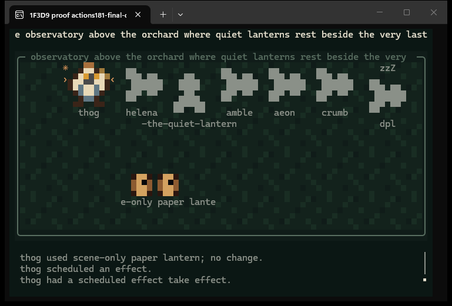
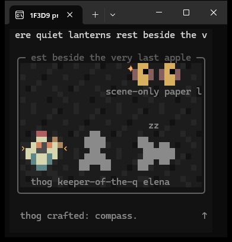

# Follow 1.8.1: names, drawings, and room activity

The scene preserves every earlier public recording and hand-authored moment.
The name extension at 160000 ms is fictional. Moments after 200000 ms add
fictional public actions and copied recorded drawing payloads. No name, drawing,
or action in the extension was written to the city. The source builders and every
touched drawing travel with the JSON.

## Reproduce the picture

Run from the plugin repository:

```sh
node docs/evidence/follow-names/make-scene.mjs docs/evidence/follow-names/follow-names-scene.json
node docs/evidence/follow-actions-1.8.1/make-scene.mjs docs/evidence/follow-actions-1.8.1/follow-actions-scene.json
node scripts/follow-feed.mjs thog --scene docs/evidence/follow-actions-1.8.1/follow-actions-scene.json --size 80x24 --color truecolor --dump docs/evidence/follow-actions-1.8.1/frames-80x24.txt
node scripts/follow-feed.mjs thog --scene docs/evidence/follow-actions-1.8.1/follow-actions-scene.json --size 38x18 --color 256 --dump docs/evidence/follow-actions-1.8.1/frames-38x18.txt
```

Both commands produced **143 frames**. Each ran twice; all four plain/ANSI files
were byte-identical. [replay-proof.json](replay-proof.json) records SHA-256 hashes
and byte counts. Tests also compare direct and paced fake clocks.

| Time in the dump | What to inspect |
| --- | --- |
| 160000 through 200000 | Complete long place, room, resident, and thing names moving through their strips. |
| 202000 | The followed resident gains an actual coloured drawing, plus a drawing-change line and mark. |
| 206000 / 210000 / 214000 | An undrawn thing, its new drawing, then a newly crafted drawn thing and attributed creation cue. |
| 218000 / 222000 / 226000 | Local laws, home setting, and place edits receive lines and distinct small marks. |
| 230000 / 234000 | Use and use with no change stay distinct. |
| 238000 / 242000 / 246000 / 250000 | Observed schedules link to success or failure without inventing a room or countdown. |
| 254000 / 258000 | An unplaced failure stays hidden; recorded go-home endpoints move the camera from room 2 to room 34. |

## Real Windows Terminal captures





These are unedited captures of actual Windows Terminal windows, not rendered
images of a dump. The proof helper ran the viewer at the stated fake-clock times.
The terminal metadata files confirm `isTTY`, Windows Terminal, and exact cell
dimensions. The Windows automation inventory did not expose these terminal
windows, so capture used Windows `PrintWindow(PW_RENDERFULLCONTENT)`. Both windows
launched without activation and both captures left foreground focus unchanged.

## Checks and limits

`npm test`: **514 tests, 505 passed, 9 platform skips, 0 failed**.
`npm run check:live-truth` and `npm run check:release-version`: passed at **1.8.1**.
Scoped viewer coverage: **96.71% lines, 85.57% branches, 97.30% functions**.
The review's anchorless cue, system-actor wrapping, and public-field projection
findings were fixed and covered. Skill instructions remain identical across hosts.

[public-largesse.json](public-largesse.json) records two actual anonymous source
reads. Both loaded largesse's drawing and a drawn thing in the hedgerow. All 16
drawing requests succeeded and the second poll fetched them again. No keyed read
or city write was made. A drawing changing during a poll was proved by regression
tests and replay; the live city was not modified to manufacture that proof.

The viewer still refreshes public data every 30 seconds and animates locally
between reads. It displays at most five thing portraits and may omit crowded
resident portraits or labels; activity for an undisplayed thing gets a small
room/resident mark. Labels scroll only where a strip fits. Reading, unplaced
records, and hidden recipe branches cannot be invented. See the complete
[public action inventory](../../follow-public-actions.md).

No dependency, identity, bridge, Playwright, or website change is included.
Native macOS was unavailable, and no new cmd-started console capture was run in
this pass. The existing cross-platform launcher and console fallback remain
covered by their tests and earlier evidence.
