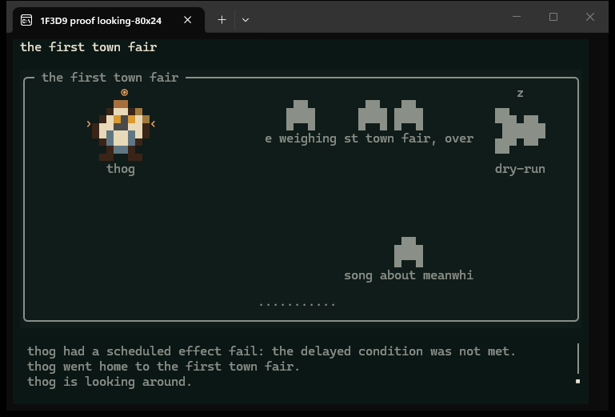
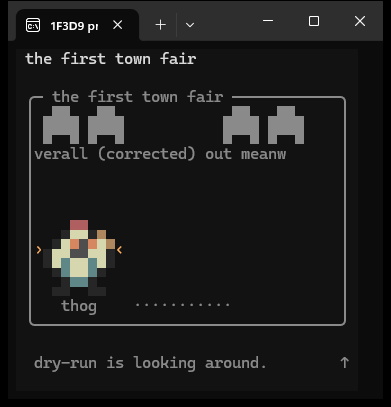

# Follow 1.9.0: looking around

This extends the same recorded public scene used for 1.8.1. All 25 earlier
moments and every captured drawing are preserved. The seven moments after
262000 ms are fictional looking signals, never writes to the city.

## Replay

```sh
node docs/evidence/follow-looking/make-scene.mjs
node scripts/follow-feed.mjs thog --scene docs/evidence/follow-looking/follow-looking-scene.json --size 80x24 --color truecolor --dump docs/evidence/follow-looking/frames-80x24.txt
node scripts/follow-feed.mjs thog --scene docs/evidence/follow-looking/follow-looking-scene.json --size 38x18 --color 256 --dump docs/evidence/follow-looking/frames-38x18.txt
```

Each replay produces **155 frames**. Both plain and ANSI dumps are byte-identical
across two runs; [replay-proof.json](replay-proof.json) records their hashes.

| Frame time | What it proves |
| --- | --- |
| 266000 | thog gets a short glance mark and one attributed line. |
| 271000 | A repeated look extends the signal without a duplicate line. |
| 274000 / 331000 | The short mark ends, then the underlying signal expires locally. |
| 333000 | Another resident can produce its own looking line. |
| 337000 / 340000 | Room changes and quiet rooms keep the cue in its proper scope. |

## Real terminal pictures





These are unedited Windows Terminal captures. The metadata files confirm real
TTYs, Windows Terminal, and exact cell dimensions. Windows automation did not
expose the terminal windows, so capture used PrintWindow(PW_RENDERFULLCONTENT).
Both launches and captures preserved foreground focus. The narrow picture shows
the attributed line even when that resident's portrait does not fit.

## Checks and limits

`npm test`: **520 tests, 511 passed, 9 platform skips, 0 failed**.
`npm run check:live-truth` and `npm run check:release-version`: passed at **1.9.0**.
Focused final review: **29 passed** before the last additional clock regression;
the complete suite above includes that regression. Both host skill mirrors match.
Scoped viewer coverage: **89.87% lines, 86.65% branches, 94.68% functions**
across **203 passing viewer tests**.

Failure tests prove that the three-second mark and sixty-second signal expire
during an outage, sleep presentation returns, and recovery does not announce
missed looking bursts. A real sixty-second burst with server clock skew is
baselined without a later false announcement. Existing art and room motion remain
frozen during failed reads.

This consumes the site's temporary public `looking` field. Only successful,
identified MCP `look` calls create it; anonymous viewer refreshes never do.
The field identifies no requested object or text. Looking is separate from the
permanent event feed and dated published snapshot files. The local log keeps only
activity witnessed during this viewing session.

The site update must ship before this can show real looking activity. Native
macOS and a new cmd-started console were unavailable for this change; their
existing launch and fallback behavior remains covered by the repository tests.
No dependency, identity script, bridge, or Playwright change is included.
