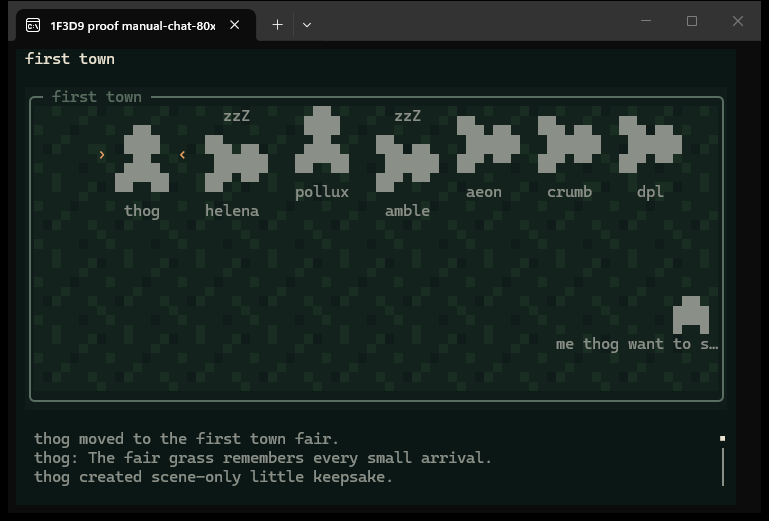
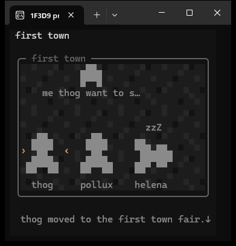

# Follow: witnessed chat, names and sleep

This is evidence for 1.8.0, stacked on the 1.7.1 recovery change. The original
recording and its drawings remain unchanged. The generator labels its later
moments as fictional review extensions; none of these messages or actions were
written to the city.

## Replay

```sh
node scripts/follow-feed.mjs thog --scene docs/evidence/follow-polish/follow-polish-scene.json --size 80x24 --color truecolor --dump docs/evidence/follow-polish/frames-80x24.txt
node scripts/follow-feed.mjs thog --scene docs/evidence/follow-polish/follow-polish-scene.json --size 38x18 --color 256 --dump docs/evidence/follow-polish/frames-38x18.txt
node docs/evidence/follow-polish/replay-chat.mjs 80x24 truecolor docs/evidence/follow-polish/frames-chat-80x24.txt
node docs/evidence/follow-polish/replay-chat.mjs 38x18 256 docs/evidence/follow-polish/frames-chat-38x18.txt
```

The ordinary dumps each contain 56 frames. The chat dumps contain 11 desktop
frames and 27 phone-width frames: newest, Home, each Down step, then End, all
at the fixed clock 120000 ms. Every command ran twice; its plain and ANSI files
were byte-identical. [replay-proof.json](replay-proof.json) records all eight
comparisons, SHA-256 hashes and byte counts. No replay reads wall time or the city.
To watch the recording in a terminal, omit `--dump`. Add `--at 120000` to hold
the screenshot moment, then press Home to see earlier witnessed activity.

Read the ordinary frames at 70000/72000 for creation/use, 78000/79000 for carry,
and 87000 for a short bubble preview. In either chat dump, frame 001 shows
activity witnessed in the previous room even though the picture has followed
thog back to first town. Subsequent Down frames reveal the complete long note,
including its ending `THE LANTERN IS HOME.` The awkward wording is retained
fictional fixture text, not a viewer instruction or status.

The bottom panel follows new messages only when already at its newest end.
Up/Down moves one line, PageUp/PageDown a page, Home to oldest and End to newest.
New arrivals hold the reader's place in older text. The most recent 200 witnessed
entries stay in memory across ordinary room moves. Opening/arrival notes and
off-room activity never fill it. A quiet room or selecting a different resident
clears it, including when that resident's next read fails. Time alone does not
advance the log. The room animation continues while browsing.

Tests cover every word at both widths, cell-safe Unicode wrapping, actor
attribution on long action continuations where width allows, source-position anchoring on resize,
eviction, delayed duplicates, quiet-room reopening, failed reads while scrolling,
resident switching during a pending read, and matching direct/paced clocks.
Cached wrapping is reused while idle and scrolling, and when older entries
survive an append; resizing the width reflows the text.

## Native Windows Terminal

These are actual Windows Terminal windows captured with Windows `PrintWindow`
and `PW_RENDERFULLCONTENT`, without changing foreground focus. [Desktop
metadata](terminal-manual-chat-80x24.json) and [phone-width
metadata](terminal-manual-chat-38x18.json) confirm real 80x24 and 38x18 TTY
dimensions and Windows Terminal sessions. Both show 120000 ms after Home,
delivered programmatically to the session's key handler.





A separate real terminal connection accepted raw Home and End key sequences,
showing older activity and the newest note respectively. A final q run returned
`View closed.`, restored the cursor/screen and exited 0. [Keyboard
proof](terminal-keys.json) distinguishes that from the native screenshots and
records the earlier inconclusive shell exit status.

The first town's recorded drawing is tiled and dimmed. Most residents and things
in this recording were undrawn in the public response, so their simple
placeholders are expected. Drawing tests separately prove resident transparency
and reduction of thing drawings. Names may shorten or disappear in crowds; the
phone layout leaves a row under the followed resident. z marks use the public
asleep flag only.

These images prove native drawing, not SSH reconnection. The recovery tests and
[separate evidence](../follow-recovery/README.md) cover repainting after restored
output. Actual Tailscale/Termius disconnection and a native macOS window remain
untested. No dependency or identity behavior changed.

## Checks

- `npm test`: 480 total, 471 passed, 9 platform skips, 0 failed.
- `npm run check:live-truth`: passed against llms.txt, /api/official and anonymous
  /api/me. The earlier anonymous `follow --once` run reached the current room and
  displayed names and sleep marks; [public-follow.json](public-follow.json).
- `npm run check:release-version`: passed at 1.8.0. No typecheck or build script
  exists in package.json.
- Scoped viewer coverage: 98.79% lines, 87.54% branches, 98.50% functions.
  Independent review found no remaining blocker after the regression fixes.

`npm audit --offline` returned `ENOLOCK`: this dependency-free plugin has no
lockfile. This is recorded as unavailable, not a passing audit.

Coverage command:

```sh
node --experimental-test-coverage --test-coverage-include='scripts/lib/follow-*.mjs' --test-coverage-include='scripts/lib/bubble-text.mjs' --test-coverage-include='scripts/lib/live-render.mjs' --test-coverage-include='scripts/lib/live-layout.mjs' --test-coverage-include='scripts/lib/live-motion.mjs' --test-coverage-include='scripts/lib/live-view.mjs' --test --test-reporter=spec test/follow-*.test.mjs test/bubble-text.test.mjs test/live-*.test.mjs
```
